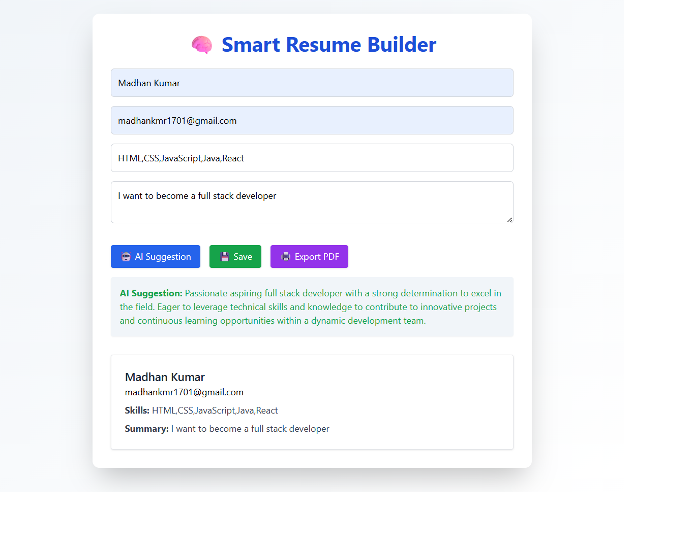

# 🚀 Internship Projects — ELEVATE LABS

👨‍💻 Internship by: **Madhan Kumar**  
📅 Internship Domain: Full Stack Web Development  
🏢 Company: ELEVATE LABS  
🌐 GitHub: [MadhanKumar1701](https://github.com/MadhanKumar1701)  
🔗 LinkedIn: [madhan-kumar17](https://www.linkedin.com/in/madhan-kumar17)

---

## 📋 Projects Included:

✅ 1️⃣ Smart Resume Builder  
✅ 2️⃣ Real-Time Chat App  
✅ Project Reports attached in `/Reports` folder.

---

## 🌟 1️⃣ Smart Resume Builder

A full-stack, AI-powered Resume Builder built with **React**, **Tailwind CSS**, **Node.js**, **MongoDB**, and **OpenRouter (GPT-3.5)**.  
This project demonstrates frontend design, backend API integration, cloud database usage, and AI-driven resume enhancement — ideal for showcasing your skills as a **Full Stack Developer**!

---

## 🎯 Features

- 🤖 AI-powered resume summary improvement using GPT-3.5 via OpenRouter  
- 📝 Clean and intuitive form UI to create and edit resumes  
- 🖨️ Export resumes as PDF with print-friendly styling  
- 💾 Save resumes securely to MongoDB Atlas via Express API  
- 💡 Modern, stylish UI built with Tailwind CSS including gradients and animations  

---

## 🛠️ Tech Stack

### Frontend
- ⚛️ React 18.2.0 (Create React App)  
- 🎨 Tailwind CSS  
- 📦 Axios (for HTTP requests)  
- 🖨️ react-to-print (PDF export)  

### Backend
- 🌐 Node.js & Express  
- 📄 RESTful API endpoints for `/suggest` (AI summary) and `/save` (MongoDB storage)  
- 🌍 MongoDB Atlas (Cloud database)  
- 🧠 OpenRouter GPT-3.5 (AI suggestion engine)  

---

## 📸 Screenshot



---

## 🚀 How It Works

1. User fills out the resume form fields.  
2. Clicks **AI Suggestion** button — gets an improved summary generated by GPT-3.5.  
3. Clicks **Save** — the resume data is saved to MongoDB Atlas through the backend API.  
4. Clicks **Export PDF** — a downloadable PDF version of the resume is generated with print styling.  

---

## 📦 Running Locally

```bash
# Clone the repo and navigate to the client folder
cd client
npm install
npm start

# In a separate terminal, navigate to the server folder
cd ../server
npm install
node index.js

```

## 💬 2️⃣ Real-Time Chat App

# 🚀 Real-Time Chat App

A modern, secure, and responsive real-time chat platform — built using Node.js, Express, MongoDB, Socket.IO, and Tailwind CSS.

---

## 📸 Screenshots

### 📝 User Registration


### 💬 Chat Interface


---

## 🚀 Features

- 📝 User Registration & Login (JWT Auth)
- 💬 Real-time messaging with Socket.IO
- 👥 Online users list with live updates
- 🎨 Responsive and animated UI (Tailwind CSS + Animate.css)
- 🗄️ Chat history stored in MongoDB
- 🔐 Secure, scalable backend with Node.js & Express

---

## 💻 Tech Stack

- Node.js
- Express.js
- MongoDB
- Socket.IO
- Tailwind CSS
- Animate.css

---
